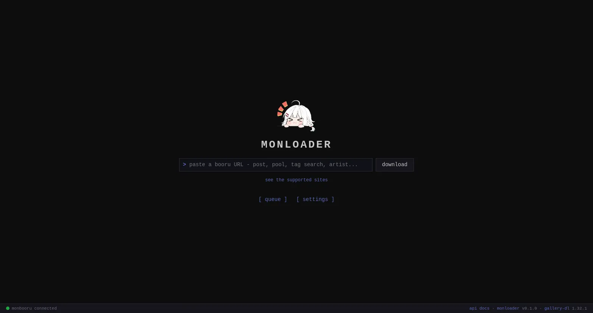
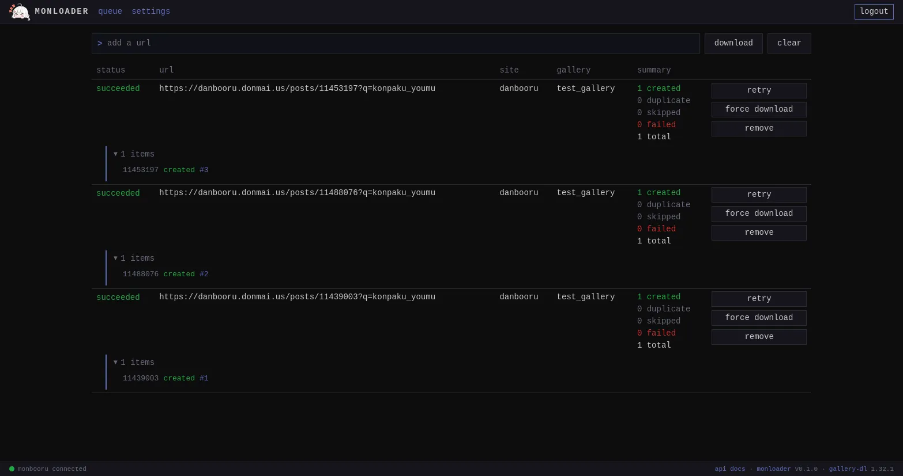

# monloader

Download images from the web into [monbooru](https://github.com/leqwin/monbooru).  
Paste a direct URL, an image or search from an online booru/gallery or [any site supported by gallery-dl](https://github.com/mikf/gallery-dl/blob/master/docs/supportedsites.md) and monloader fetches the files and per-post metadata, maps it onto monbooru's data model, and pushes each file into a monbooru gallery over the REST API.

<table>
  <tr>
    <td></td>
    <td></td>
  </tr>
</table>

---

## Features

- **Download images** A direct link to an image, or anything else a gallery-dl extractor matches : booru post, pool, tag search, artist page. 
- **Pools and manga.** A booru pool's pages import as an ordered collection; a manga or comic gallery bundles into a single `.cbz` for monbooru's reader.
- **Metadata mapped to monbooru.** Tags by category (artist / character / copyright / meta / ...), rating, and source, normalized across booru families so tags land the way monbooru expects them.
- **50+ curated sites, plus a fallback.** Profiles for the danbooru, e621, moebooru, and gelbooru families and a set of manga/comic sites; anything else gallery-dl supports still works through a generic fallback.
- **Queue management.** Every item reports `created`, `duplicate`, `skipped_archive`, `skipped_unsupported`, or `failed` with a stable error code. Monbooru's deduplication and monloader's queue mean re-submitting a URL does not re-download or double-import.

---

## Quick start

monloader ships in monbooru's `docker/docker-compose.yml` :

1. In monbooru, open **Settings -> Authentication** and generate an API token.
2. Uncomment the `monloader` service in monbooru's compose and start it:
   ```bash
   docker compose up -d monloader
   ```
3. Open monloader `http://localhost:8081`, go to **Settings -> monbooru**, paste the token, click **test connection**, then **save**.
4. Paste a URL into the command bar on the home screen and press Enter.

See [docs/README.md](docs/README.md) for installation, configuration, sites and credentials, metadata mapping, the REST API, and building from source.

---

## Warning

> **Intended for local network use.** monloader's UI is not designed to be exposed to the public internet.

---

## Acknowledgements

monloader is mostly a wrapper for [gallery-dl](https://github.com/mikf/gallery-dl), which does the actual scraping. monloader adds queue management, maps that output onto monbooru's data model and pushes it to over the API.
